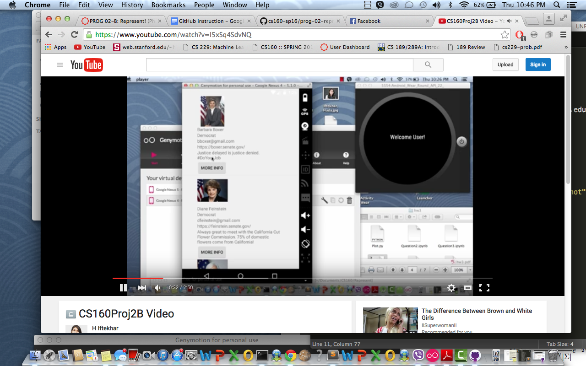
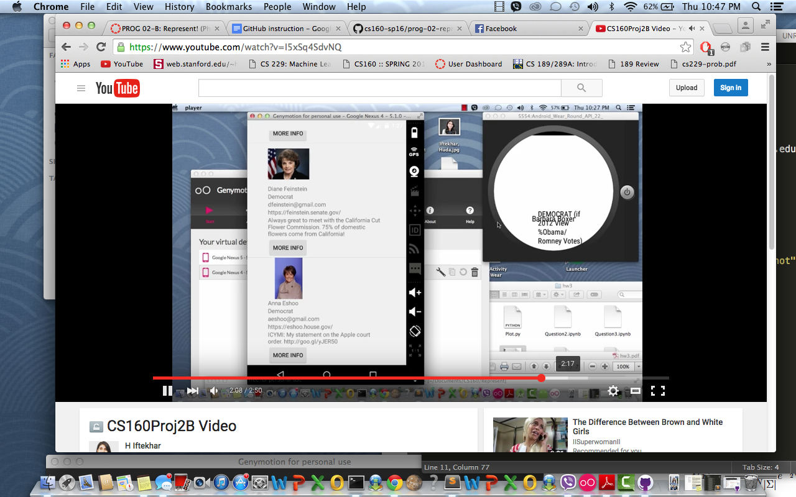
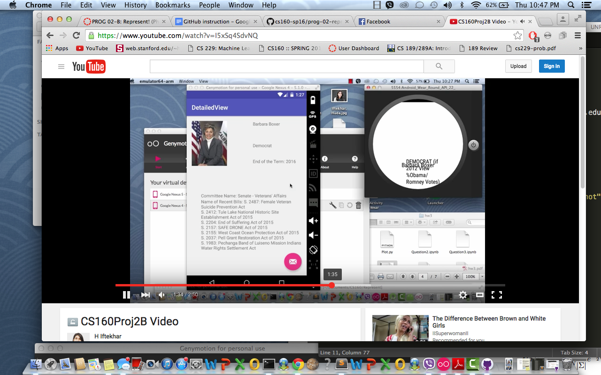
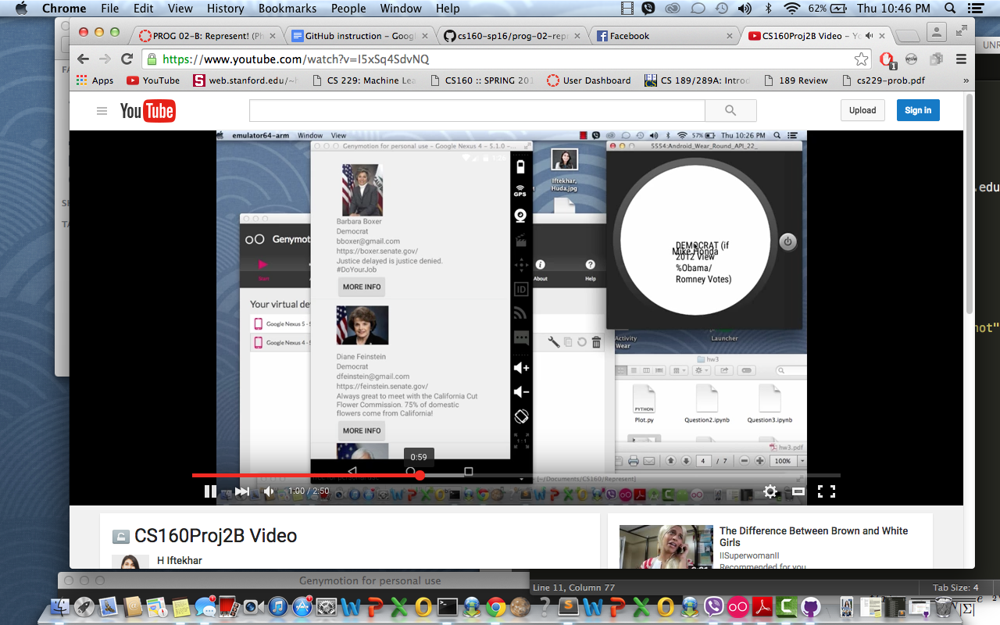
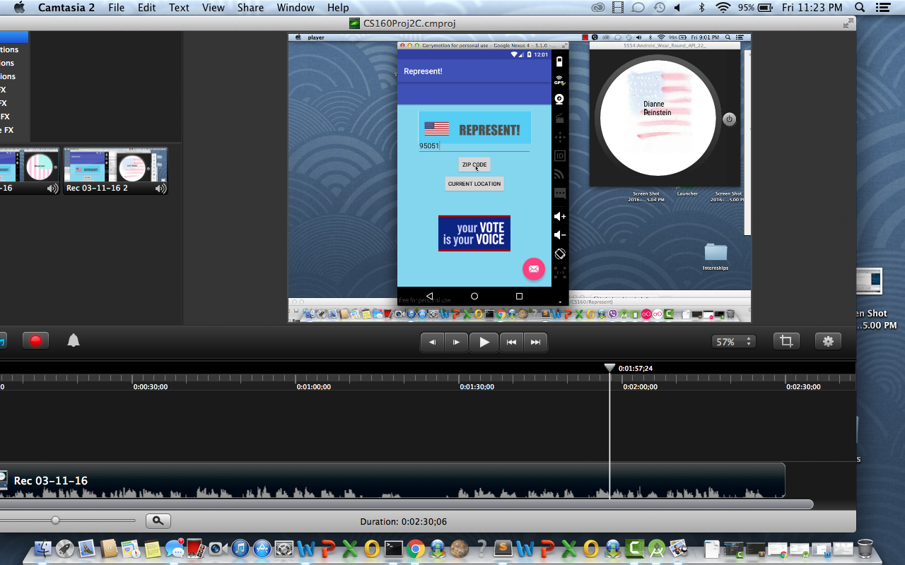
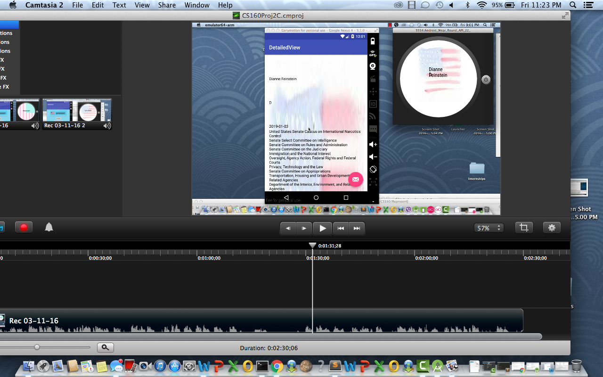

# PROG 02: Represent!

This app is a representative app to teach others about representatives. 

## Authors

Huda ([hiftekhar@berkeley.edu](mailto:your_email@berkeley.edu))

## Demo Video

See http://www.youtube.com/watch?v=Gzg2qdHkTmw

## Screenshots

 
## Acknowledgments

* Hat tip to anyone who's code was used
* Any other support

I used some StackOverFlow code for the shake portion and the UI Android Development Docs! Catnip also. The StackOverFlow code is called shake that app. 
